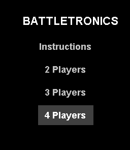
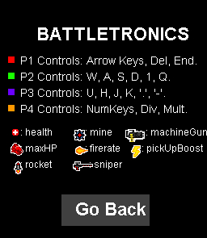
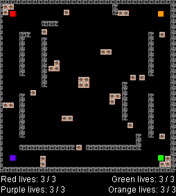
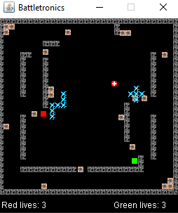
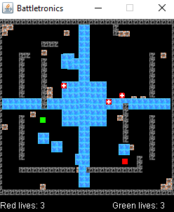
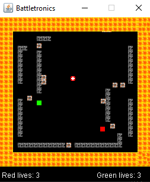

### Requirements

- Java JDK downloaded on computer.
- Terminal able to run commands: 'javac' and 'java'.

### How to start the game

0. Make sure you are in the directory/folder where the game files are located.
1. Run the command: javac \*.java
2. Then run the command: java Menu

#### Controls

- Player1: arrow keys, delete, end.
- Player2: w, a, s, d, 1, q.
- Player3: u, h, j, k, ".", "-".
- Player4: numkey8, numkey4, numkey5, numkey6, numkey_divide, numkey_multiply.

#### Preview images of the game

     

#### Class Hierarchy

- Menu / MenuInstructions / SoundEffects
- App / Battletronics
- SetKeyBindings / PlayerMovement / PlayerInventory / CreateBattlefield
- CollisionDetection / HealthPackSpawn / PowerUpSpawn / Environment
- FireRing / LightningStorm / WaterFlood
- Sprite is parent to -> All visable objects
- Blocks / HealthPacks / Powerups
